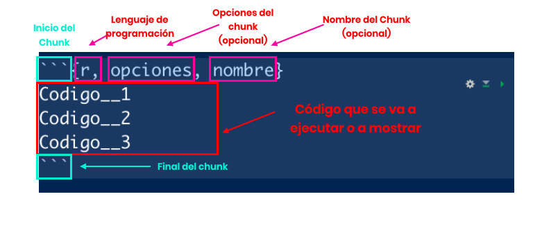

<style>

@import url('https://fonts.googleapis.com/css2?family=Poppins:wght@800&display=swap');
@import url('https://fonts.googleapis.com/css2?family=Poppins&display=swap');


  p {
    font-size:20px;
    font-family:Poppins;
  }
  
  h1,h2,h3 {
    color:#0b5239;
    font-family:Poppins-Bold;
    text-align:center;
  }
  
  .author_name{
    font-family:Poppins-Bold;
  }
  
  .author_bio{
    font-family:Poppins;
  }
  
  th{
    background-color:#e87758;
  }
  
</style>

```{r setup, include=FALSE}
knitr::opts_chunk$set(echo = TRUE)
```

# Código. 

`R Markdown` nos permite introducir y correr código de R (y de otros lenguajes de programación). 

# Introducción de Código. 

Para introducir código, utilizamos los `chunks` (pedazos de código). Estos `chunks` se generan con el siguiente formato: 



* **Inicio: ** Iniciamos un chunk de código con tres ticks (```). Esto le dice a RStudio que a partir de acá active R para procesar la información.

* **Nombre del lenguaje de programación: ** R Markdown, configurado adecuadamente, puede ejecutar código tanto de R como de otros lenguajes de programación (como `python` o `julia`). Por esto, es necesario especificar el lenguaje de programación. 

* **Opciones: ** Después escribimos las opciones que queremos utilizar. Estas opciones son varias y se incluyen para controlar como queremos que se muestre el código y el resultado de este. 

* **Nombre: ** Podemos ponerle el nombre a cada `chunk` para tener mejor orden del documento. Este es opcional. 

* **Código: ** Aquí es donde va el código que queremos que se ejecute (o que queremos mostrar). 

* **Cierre: ** Volvemos a utilizar los tres "ticks" para indicarle a R Markdown que vamos a seguir escribiendo texto normal. 

# Opciones para mostrar o ocultar el código.

Cuando tenemos la facultad de escribir código para nuestros documentos, caemos en una de las siguientes situaciones: 

1. Queremos mostrar el código, pero que no se ejecute (sólo queremos enseñar cómo se hace algo). En este caso, utilizamos la opción `eval = FALSE` dentro de los corchetes. 

2. Queremos mostrar el código y el resultado. Tanto cómo se hace como el resultado final. Este y el anterior son los ideales cuando estamos escribiendo tutoriales de programación, como este. En este caso no es necesario poner ninguna opción adicional. 

3. Queremos solo mostrar el resultado (por ejemplo, una _visualización interactiva_) pero no queremos enseñar como se hace. Esto es importante si estamos generando un artículo de blog o de periódico digital, ya que muestra el resultado, pero no el proceso para elaborarlo. Para esto, incluímos la opción `echo = FALSE`

# Opciones para visualizar el contenido resultante. 

Para controlar el tamaño de una gráfica, podemos utilizar la opción `out.width='XXXpx'` o `out.height='XXXpx'`, y especificar un tamaño en pixeles que se adapte a nuestras necesidades. 

Igualmente, para alinear una imagen, podemos utilizar el argumento `fig.align` y especificar el alineamiento: `fig.align='left'` alinea la imagen a la izquierda, `fig.align='right'` a la derecha y `fig.align='center'` la centra.

# Opciones para silenciar mensajes. 

Muchas veces R nos manda alertas o mensajes que, si bien son útiles cuando estamos trabajando, puede ser molestos para los lectores o público en general. Estos se silencían con las opciones `warning=FALSE, cache=FALSE, message=FALSE`. Mi recomendación es utilizarlas todas al mismo tiempo.

> Nota: Hay funciones de R (como `sf::st_read()`) que imprimen mensajes independientemente de escribir estas opciones. En este caso, la impresión de mensaje se controla con el argumento `quiet = TRUE` de dicha función. 

# ¿Y el código? 

El código de R simplemente se agrega dentro de la sección de código. 

**Observaciones:**

* Hay que tener en cuenta que, si no silenciamos la impresión del código `echo=TRUE`, el chunk de código impreso se va a romper cada vez que le pidamos al código que imprima algo.

* Se recomienda **primero hacer un script de R y luego pasar a trabajar en R Markdown**, ya que el primer formato nos permite experimentar de manera más sencilla que el segundo. Sin embargo, si se desea trabajar directo en R Markdown, hay que tener en cuenta que el código se ejecuta con la flecha de "play" que aparece en la parte superior derecha del `chunk`, y que el resultado del chunk **se imprime justo debajo del chunk, no en la consola, como ocurre normalmente.** 

