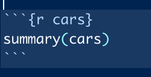

<style>

@import url('https://fonts.googleapis.com/css2?family=Poppins:wght@800&display=swap');
@import url('https://fonts.googleapis.com/css2?family=Poppins&display=swap');


  p {
    font-size:20px;
    font-family:Poppins;
  }
  
  h1,h2,h3 {
    color:#0b5239;
    font-family:Poppins-Bold;
    text-align:center;
  }
  
  .author_name{
    font-family:Poppins-Bold;
  }
  
  .author_bio{
    font-family:Poppins;
  }
  
  th{
    background-color:#e87758;
  }
  
</style>

```{r setup, include=FALSE}
knitr::opts_chunk$set(echo = TRUE)
```

## R Markdown (traducción del documento guía)

Esto es un documento de RMarkdown. Markdown es una sintáxis para dar formato de  manera simple al momento de construir documentos HTML, PDF o de Microsoft Word. Para más detalles sobre usar R Markdown ver <http://rmarkdown.rstudio.com>.

Cuando le damos click al botón de **Knit**, un documento será generado. Este documento incluye tanto contenido (texto, imágenes, videos, formato) como el resultado de cualquier _chunk_ (pedazo) de código dentro del documento. 

El usuario puede meter un _chunk_ (pedazo) de código de la siguiente manera: 



El cual se verá dentro del código de la siguiente manera: 

```{r cars}
summary(cars)
?cars
```

* Lo que ocurrió tras poner el código anterior, fué que RStudio entendió (con los tres ticks) que venía una sección de código. Después entendió que este código era código de R, que el pedazo de código llevaría el nombre de `cars` (como el objeto más relevante que usa) y que ejecutaría la línea de código `summary(cars)`, la cual nos proporciona estadísticas sumario de la base de datos `cars`, que ya viene, por default, en la librería `{datasets}` cargada desde el inicio por R. 

## Inclusión de gráficas

Igualmente, podemos incluir gráficas, por ejemplo: 

```{r pressure}
plot(pressure)
```

Nos genera una gráfica a partir de la base de datos `pressure`, también de la librería `{datasets}`. 

**IDEA CLAVE:**

* **Lo que R Markdown va a imprimir en la página posteriormente a un _chunk_ de código es lo que imprimiría normalmente `RStudio` en la consola.**

Esto nos permite poder redactar páginas web que contengan el resultado de nuestros análisis de econometría, o tablas con nuestra información, o que incluya videos explicativos, o enlaces a otras páginas o papers, o nuestra información de contacto, o las visualizaciones interactivas que generamos en la consola y que eventualmente queremos compartir con otras personas. 

A continuación, veremos, de manera muy rápida, cosas que necesitamos para poder trabajar con R Markdown para que, al terminar la sesión, estar listos para tener lo básico para intentar realizar nuestros propios documentos. 

*Temas:*

Para más referencias sobre los temas necesarios para construir documentos en RMarkdown, checar los siguientes enlaces.

1. [Texto](https://rpubs.com/Juve_Campos/textoRMarkdown)
2. [Código](https://rpubs.com/Juve_Campos/codigoEnRMarkdown) 
3. [Imágenes y multimedia](https://rpubs.com/Juve_Campos/ImagenesyMultimediaEnRmarkdown)
4. [Tablas](https://rpubs.com/Juve_Campos/tablasRMarkdown)
