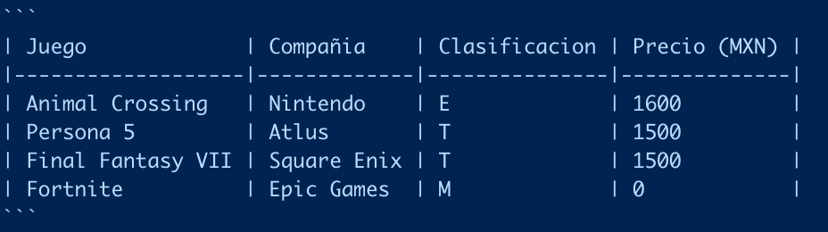

<style>
  p {
    font-size:20px;
    font-family:Poppins;
  }
  
  h1,h2,h3 {
    color:#0b5239;
    font-family:Poppins-Bold;
    text-align:center;
  }
  
  .author_name{
    font-family:Poppins-Bold;
  }
  
  .author_bio{
    font-family:Poppins;
  }
  
  th{
    background-color:#e87758;
  }
  
</style>

# Tablas

Para incluir información en forma de tablas en R Markdown, tenemos que escribir la información en un formato especial, o utilizar alguna librería de visualización de datos. 

## Tablas pequeñas

Para las tablas pequeñas, podemos utilizar un formato especial para escribir pequeñas tablas en Markdown. 

Por ejemplo, esta tabla: 

| Juego             | Compañia    | Clasificacion | Precio (MXN) |
|-------------------|-------------|---------------|--------------|
| Animal Crossing   | Nintendo    | E             | 1600         |
| Persona 5         | Atlus       | T             | 1500         |
| Final Fantasy VII | Square Enix | T             | 1500         |
| Fortnite          | Epic Games  | M             | 0            |

Se dibuja con el siguiente código: 

```
| Juego             | Compañia    | Clasificacion | Precio (MXN) |
|-------------------|-------------|---------------|--------------|
| Animal Crossing   | Nintendo    | E             | 1600         |
| Persona 5         | Atlus       | T             | 1500         |
| Final Fantasy VII | Square Enix | T             | 1500         |
| Fortnite          | Epic Games  | M             | 0            |
```

Que en el editor se ve así: 




El código anterior se puede generar en la página siguiente: https://www.tablesgenerator.com/markdown_tables, la cual nos proporciona una manera sencilla de generar tablas sencillas en Markdown, elemento a elemento. 

## Utilizando librerías de visualización. 

En el caso en que no querramos crear nuestras tablas elemento a elemento, sino utilizar una base de datos, hay dos librerías recomendadas para realizar este fin: 

* {kable} - Recomendable para tablas pequeñas y medianas (que quepan bien en la pantalla). 

* {DT} - Recomendable para tablas grandes (que no quepan en la pantalla).

Las cuales nos generan tablas HTML para poder visualizar en nuestros documentos de RMarkdown. 

Para ilustrar lo anterior, vamos a trabajar con la base de datos de Tweets de el Joker, la cual se puede descargar desde este [enlace](https://raw.githubusercontent.com/JuveCampos/miniProyectos/41d18f7ef7d17e04601e3e9a399f9c079cdceadc/elJokerWordCloud/db.csv).

```{r warning=FALSE, message=FALSE, cache=FALSE}
# Librerias
library(tidyverse)
library(DT)
library(kableExtra)
```

A continuación, vamos a generar la tabla de `Kable`.

```{r}
dt <- mtcars[1:5, 1:6]
kbl(dt)
```

```{r}
# Tabla kable con estilo CSS Bootstrap
dt %>%
  kbl() %>%
  kable_styling()
```

```{r}
# Tema Hover (se ilumina el renglón si le pasamos el cursor)
dt %>%
  kbl() %>%
  kable_paper("hover", 
              full_width = F)
```

```{r}
# Estilo documento de Latex para PDF. 
dt %>%
  kbl(caption = "Recreating booktabs style table") %>%
  kable_classic(full_width = F, html_font = "Cambria")
```


```{r}
# Otro para estilo PDF
dt %>%
  kbl() %>%
  kable_classic_2(full_width = F)
```

```{r}
# Estilo Oscuro
dt %>%
  kbl() %>%
  kable_material_dark()
```

Como podemos ver, lo que hay que hacer es: 

1. Poner el nombre del objeto que guarda tu base de datos. 

2. Escribir el código que genera tu tabla (lo cual puedes copiar y pegar). 

Y ya. Para ver más tablas puedes visitar su documentación, en el siguiente [enlace](https://cran.r-project.org/web/packages/kableExtra/vignettes/awesome_table_in_html.html). 

## Tablas DT. 

Las tablas de DT son más aptas para tablas grandes. En el siguiente ejemplo vamos a utilizar la base de datos de Tweets de la película de The Joker para ver como puede funcionar la librería. 

```{r}
joker <- read_csv("https://raw.githubusercontent.com/JuveCampos/miniProyectos/41d18f7ef7d17e04601e3e9a399f9c079cdceadc/elJokerWordCloud/db.csv")

glimpse(joker)

# Basica
DT::datatable(joker)

# En español
DT::datatable(joker, 
              options = list(
                      pageLength = 5,
                      language = list(url = '//cdn.datatables.net/plug-ins/1.10.11/i18n/Spanish.json')
              )
    )

# Tabla completa
DT::datatable(joker,
                    extensions = 'FixedColumns',
                    rownames= FALSE,
                    filter = 'top',
                    options = list(
                      pageLength = 5,
                      language = list(url = '//cdn.datatables.net/plug-ins/1.10.11/i18n/Spanish.json'),
                      autoWidth = TRUE,
                      columnDefs = 
                        list(list(width = '300px', targets = c(0,7))),
                      scrollX = TRUE,
                      escape = T)
              )


```

Para checar mayores referencias, visitar la página de documentación, disponible en este [enlace](https://rstudio.github.io/DT/). 


